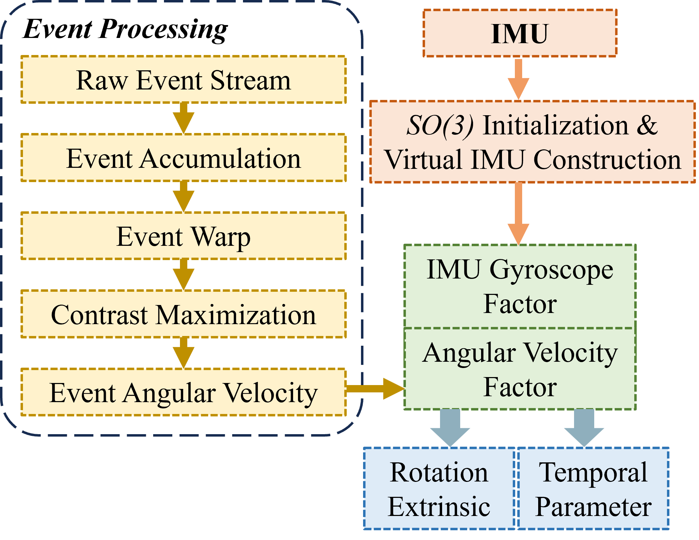

# RTEI-Calib

# A Targetless Rotation and Temporal Calibration Framework for Event **Camera**/IMU

# News

This code repository is open source at 7/9, 2024.

# Code Struture

The whole project is a ROS (only tested on Ubuntu 20.04 noetic) workspace. It contains three ros packages:
- [catkin_simple](https://github.com/catkin/catkin_simple): the module makes`catkin` packages simpler
- [rpg_dvs_ros](https://github.com/uzh-rpg/rpg_dvs_ros): C++ driver for  [Dynamic Vision Sensors (DVS/DAVIS)](https://inivation.com/dvp/)
- rtei_calib: the main package to solve calibration issue

# System Overview

<div align=center></div>

# Boot RTEI-Calib

1. Prerequisites

   + install **ROS** (for Ubuntu 20.04):

     ```bash
     sudo apt install ros-noetic-desktop-full
     echo "source /opt/ros/noetic/setup.bash" >> ~/.bashrc
     source ~/.bashrc
     ```

     note that the '**OpenCV**' and '**PCL**' libraries are integrated into it.

   + install **Ceres**:

     ```bash
     sudo apt-get install libceres-dev
     ```

   - install **yaml-cpp**:

     ```bash
     sudo apt-get install libyaml-cpp-dev
     ```

   + install **Sophus**:

     see the GitHub Profile of **[Sophus](https://github.com/strasdat/Sophus.git)** library, clone it, compile it, and install it.

   + install **magic-enum**:

     see the GitHub Profile of **[magic-enum](https://github.com/Neargye/magic_enum.git)** library, clone it, compile it, and install it.
   
   + install **fmt**:

     ```bash
     sudo apt-get install libfmt-dev
     ```

   + install **icecream-cpp**:

     see the GitHub Profile of **[icecream-cpp](https://github.com/renatoGarcia/icecream-cpp.git)** library, clone it, compile it, and install it.
   
   + install **Cereal**:
   
     ```bash
     sudo apt-get install libcereal-dev
     ```
     
2. Install

   + Git clone **RTEI-Calib** to "path"

   + Source **RTEI-Calib** in "path":
   
     ```bash
     catkin build
     ```

# Run public dataset

The proposed method is tested on the three sequences of [ECD dataset](https://rpg.ifi.uzh.ch/davis_data.html):

- [dynamic_rotation.bag](https://rpg.ifi.uzh.ch/datasets/davis/boxes_rotation.bag)

- [boxes_rotation.bag](https://rpg.ifi.uzh.ch/datasets/davis/boxes_rotation.bag)

- [shapes_rotation.bag](https://rpg.ifi.uzh.ch/datasets/davis/shapes_rotation.bag)

To run our method on these sequences, change the term "value=XXXX" in file "config/rtei-calib.launch" to **"value="$(find rtei_calib)/config/rtei-config-public.yaml""**

Source it and Just run it! "roslaunch rtei_calib rtei_calib.launch"


# Run self-collected dataset

One of the self-collected sequences are available [here](https://whueducn-my.sharepoint.com/:f:/g/personal/lishengyu_whu_edu_cn/EnRz-B4rZPFFgJTvDt5H_yMBeN8l_OtgYOQ8tFcr8EyqIA?e=la3hzG).

To run our method on this sequence, change the term "value=XXXX" in file "config/rtei-calib.launch" to **"value="$(find rtei_calib)/config/rtei-config-self.yaml""**

Source it and Just run it! "roslaunch rtei_calib rtei_calib.launch"


# Acknowledge

- Thanks to [Guo Shuang](https://github.com/tub-rip/cmax_slam) for the open source angular velocity estimation method based on [GSL Library](https://www.gnu.org/software/gsl/)


## Credit / Licensing

The codebase and documentation is licensed under the [GNU General Public License v3 (GPL-3)](https://www.gnu.org/licenses/gpl-3.0.txt).
